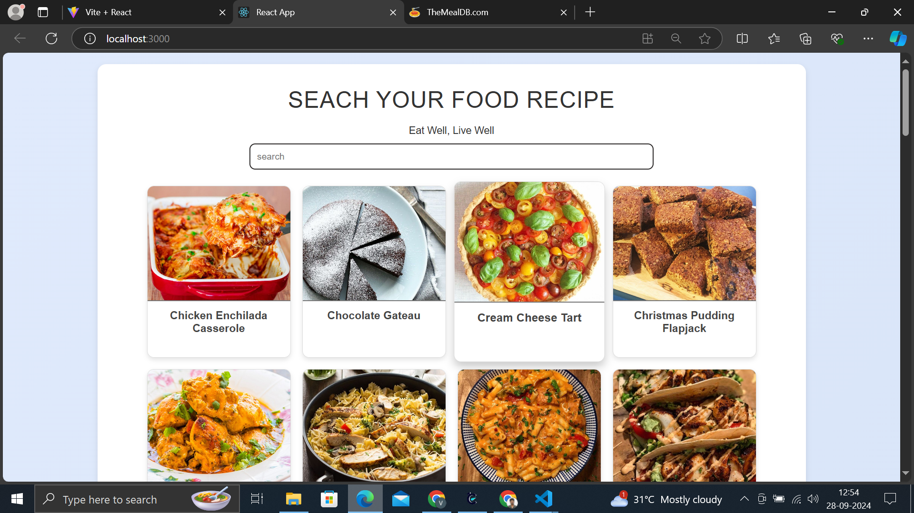

# Food Recipe App

# sample screen 
 {: width="600px"}
## Table of Contents
- [Project Overview](#project-overview)
- [Technologies Used](#technologies-used)
- [Features](#features)
- [Installation](#installation)
- [Usage](#usage)
- [API Information](#api-information)
- [Contributing](#contributing)
- [License](#license)

## Project Overview
The Food Recipe App is a web application that allows users to explore a variety of food recipes. Users can search for recipes by food name or browse through recipes organized alphabetically. Each recipe includes detailed information such as ingredients, preparation steps, and a YouTube video for further guidance. This project leverages a public API to fetch recipe data dynamically.

## Technologies Used
- **Frontend**:
  - React
  - CSS
  - JavaScript
- **API**: 
  - [TheMealDB](https://www.themealdb.com/)

## Features
- Users can **search** for recipes by food name.
- Browse recipes organized from **A to Z**.
- View detailed information about each recipe, including:
  - Ingredients
  - Preparation steps
  - YouTube video links for cooking tutorials
- User-friendly interface with a responsive design.

## Installation
To run this project locally, follow these steps:

### Steps

1. **Clone the repository**:
   ```bash
   git clone https://github.com/RVJVIJAY/foodrecipeapp.git
2.**Navigate to the project directory:**

     cd foodrecipe
3.**Install dependencies using npm or yarn:**

    npm install
4.**Start the development server:**

    npm start 
5.**Open the app in your browser:**

    Once the development server is running, open http://localhost:5173 to view the application in your browser.


# API Information
This project utilizes the TheMealDB API to fetch food recipe data. The API provides a wide range of recipes, ingredients, and other related information.

# Available Endpoints:
Search by Meal Name: /api/json/v1/1/search.php?s={mealName}
Get All Meals by First Letter: /api/json/v1/1/search.php?f={letter}
Get Meal Details: /api/json/v1/1/lookup.php?i={mealId}


### Notes
 `https://github.com/RVJVIJAY` 
- Feel free to add more details or sections as needed, such as screenshots, a demo link, or specific design instructions.
- Ensure that any additional dependencies or setup instructions are included if necessary.

This README should give users a clear understanding of your Food Recipe App and how to set it up. Let me know if you need any further modifications!
